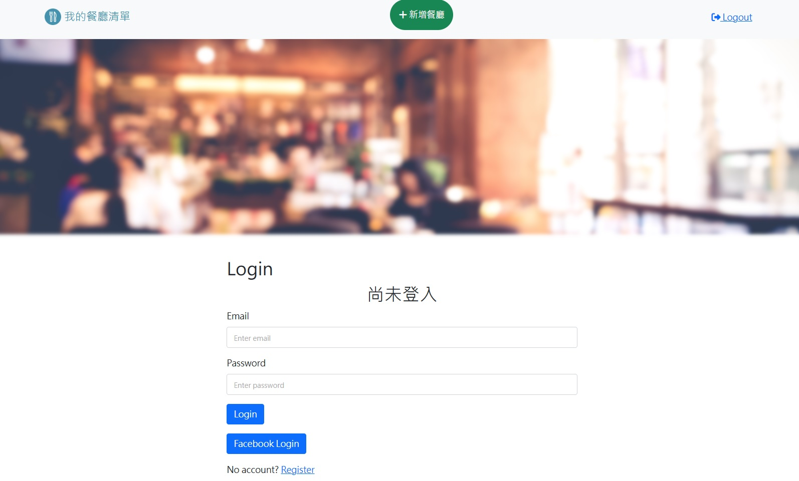
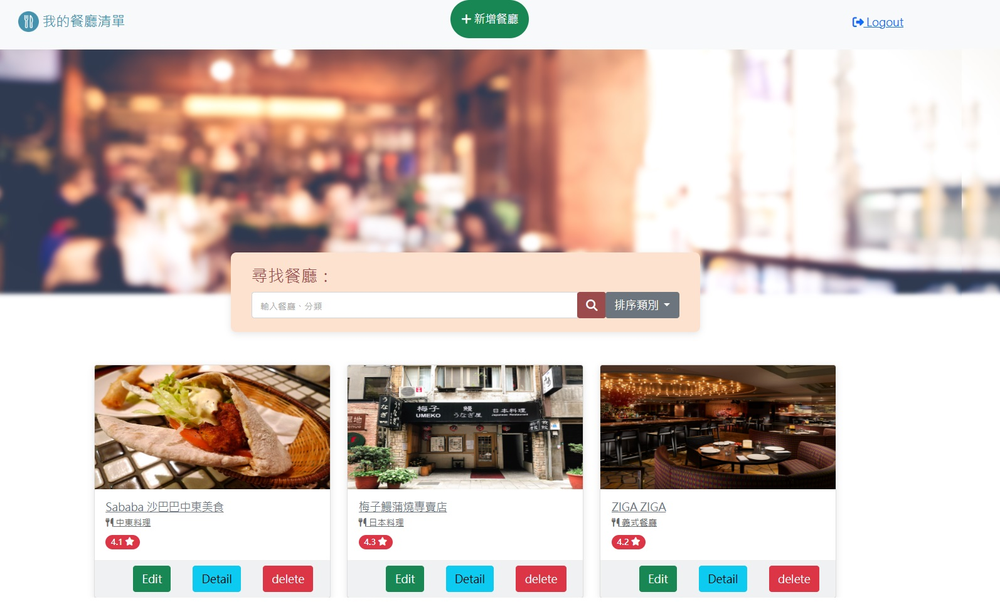

# Restaurant List




A web app that allows you to discover and search for restaurants using keywords.

## Table of Contents

- [Getting Started](#getting-started)
  - [Prerequisites](#prerequisites)
  - [Installation](#installation)
  - [Database Setup](#database-setup)
  - [Facebook App Configuration](#facebook-app-configuration)
  - [Running the App](#running-the-app)

<!-- prettier-ignore -->
> Note: Ensure you have the following prerequisites installed on your machine:
> - [Node.js v18](https://nodejs.org/) or later

### Installation

1. Clone the repository to your local machine:

   ```bash
   $ git clone https://github.com/shccgxqp/Restaurant-List.git

2. Navigate to the project directory:

   ```bash
   $ cd Restaurant-List
   ```

3. Install the required npm packages:

   ```bash
   $ npm install
   ```

### Database-Setup

1. Create a MySQL database named restaurant_list:

   ```bash
   CREATE DATABASE restaurant_list;
   ```

2. Run the SQL migration and seed to set up the database tables and seed initial data:

   ```bash
   $ npm run migrate
   $ npm run seed
   ```

### Facebook-App-Configuration

1. Create a Facebook App for OAuth login by visiting the Facebook Developers Portal.

After creating the app, you will get a Client ID and a Client Secret. Set them in your .env file as follows:

   ```bash
   FACEBOOK_CLIENT_ID=your_client_id
   FACEBOOK_CLIENT_SECRET=your_client_secret
   ```

### Running-the-App

1. Start the web app:

   ```bash
   $ npm run start
   ```

Or, if you prefer to run it in development mode with auto-reloading:

   ```bash
   $ npm run dev
   ```
   

The app should now be running locally. You can access it by opening your web browser and navigating to http://localhost:3000.
